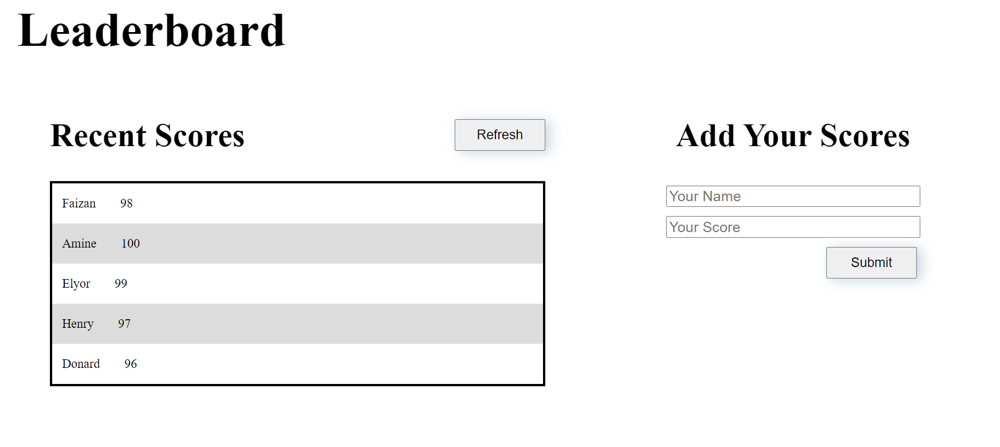

# To-Do List

> This project is focused towards building a Leaderboard. Objective of this project is to understand 
- Understand API
- Callbacks, Promises, and async functions
- Writing modular JS

Additional description about the project and its features.

## Built With

- Major languages:
1. ES6/JavaScript
2. HTML
3. CSS
- Technologies used:
1. Git
2. GitHub
3. VS Code
4. Webpack

## Live Demo

[Live Demo Link](https://faizi2500.github.io/Leaderboard/dist/)

## Getting Started

To get a local copy up and running follow these simple example steps.

Clone the repo with `git clone git@github.com:faizi2500/Leaderboard.git`

Run `npm install` from the command line

Run `npm run build` to get the app up and running.

Run `npm start` to open live server where you can see your changes and avoid repetitive use of `npm run build`

Run `npx hint .` to test for html linting check

Run `npx stylelint "**/*.{css,scss}"` to test for css linting check

The app is deployed using GitHub pages. You can view it using the 'live demo' above.

## Authors

👤 **Faizan Zahid**

- GitHub: [@faizi2500 ](https://github.com/faizi2500)
- Twitter: [@faizi_250 ](https://twitter.com/Faizy_250) 
- LinkedIn: [@faizan2500](www.linkedin.com/in/faizan2500)

## 🤝 Contributing

Contributions, issues, and feature requests are welcome!

Feel free to check the [issues page](../../issues/).

## Show your support

Give a ⭐️ if you like this project!

## 📝 License

This project is [MIT](./MIT.md) licensed.